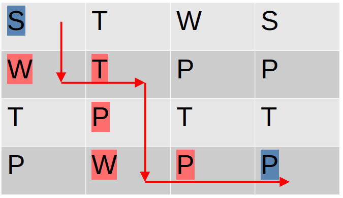

# Java_deeplay_task

Тестовое задание для отбра на стажировку в Deeplay по направлению Java.

## Задание

Вам нужно написать метод.
На вход приходят следующие параметры:
- строка, длинной 16 символов, описывающая клетки игрового поля 4*4.
- строка, содержащая расу существа.

Ваш метод должен возвращать минимальные затраты
существа на перемещения из стартовой позиции (левый верхний угол)
в конечную (правый нижний угол).

Перемещение происходит по следующим правилам:
- существо может перемещаться только вверх/вниз и влево/вправо;
- стоимость перемещения по клеткам зависит от типа клетки
и от расы существа в соответствии с таблицей ниже.

ТАБЛИЦА СТОИМОСТИ ПЕРЕМЕЩЕНИЯ СУЩЕСТВ ПО РАЗЛИЧНЫМ ТИПАМ КЛЕТОК:

|               |  Болото  |  Вода  |  Кусты  |  Равнина  |
|:--------------|:--------:|:------:|:-------:|:---------:|
| **Человек**   |    5     |   2    |    3    |     1     |
| **Болотник**  |    2     |   2    |    5    |     2     |
| **Леший**     |    3     |   3    |    2    |     2     |

Кодирование типа игровых клеток:

- Болото - "S"
- Вода - "W"
- Кусты - "T"
- Равнина - "P"

Кодирование существ:

- Человек - "Human"
- Болотник - "Swamper"
- Леший - "Woodman"

ПРИМЕР ВХОДНЫХ И ВЫХОДНЫХ ДАННЫХ:

"STWSWTPPTPTTPWPP"

"Human"

Выходные данные - 10

## Решение

